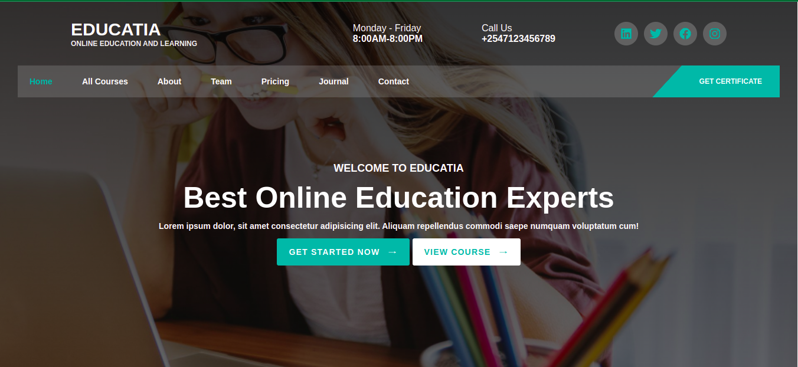
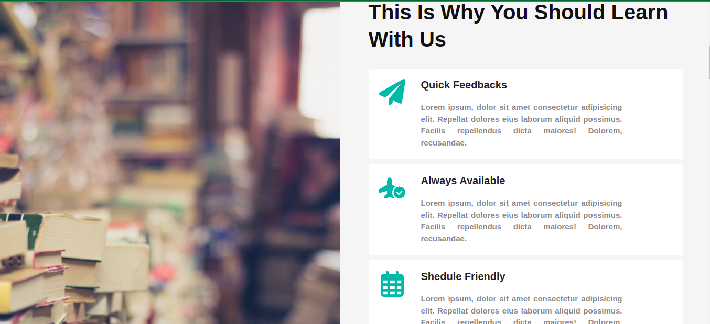
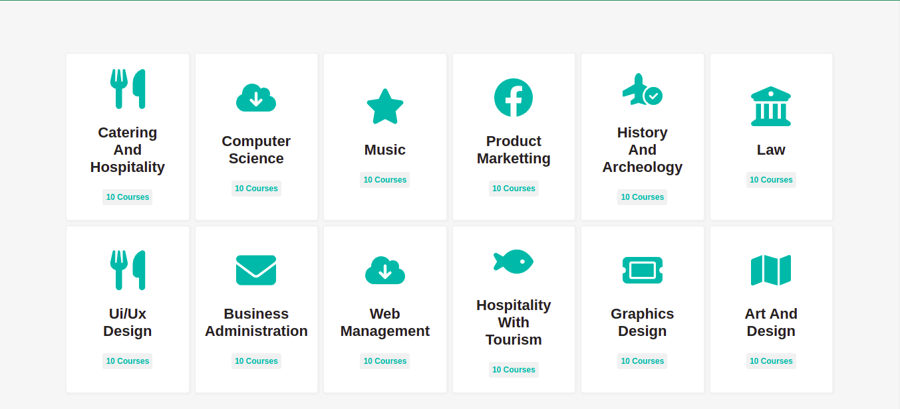
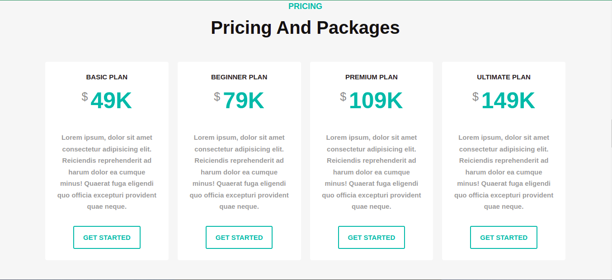
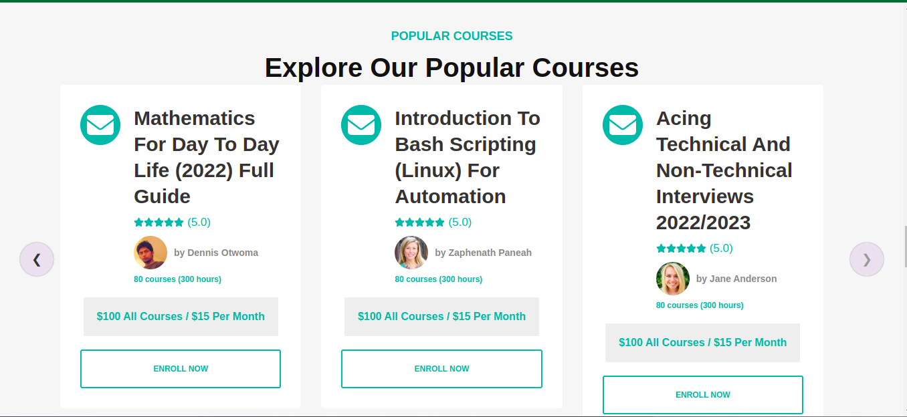
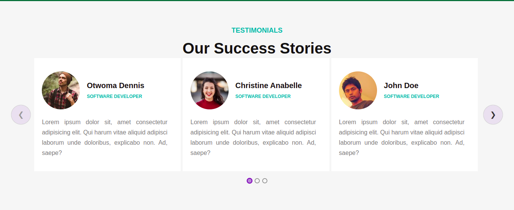
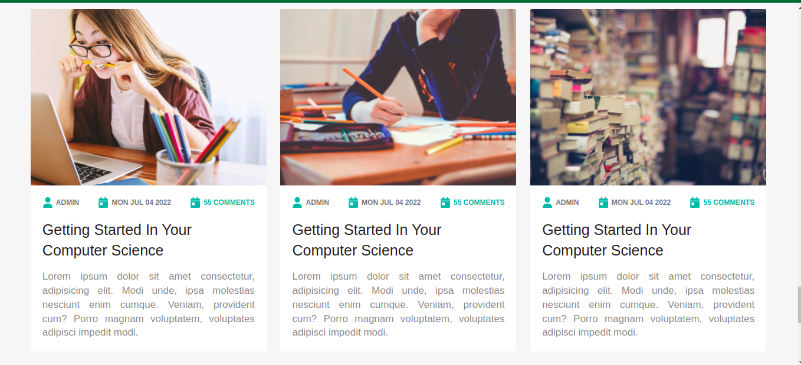
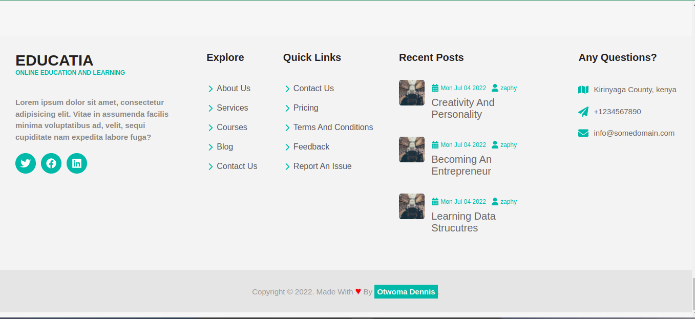

# EDUCATIA
## This is a website for a fictional online learning platform
### Below are the screenshots of the final project

# Home section


# About Section


# Courses Section


# Pricing Section


# Popular Courses Section


# Testimonials Section


# Blog Section


# Footer 


### To get started, clone this repository, navigate to the folder repository then run  ```npm install```  , once this finishes, run ```npm start``` to view the website locally.

[Follow me in LinkedIn](https://www.linkedin.com/in/otwoma)